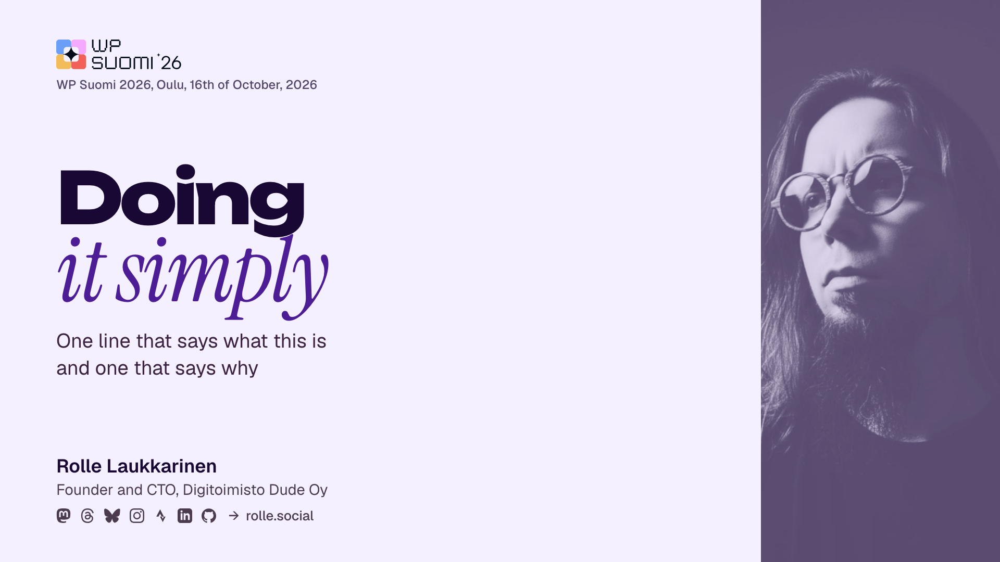

<h1 align="center">🚀 Keynote base</h1>

<p align="center">
  <strong>Rolle's personal speaker template for slides.</strong>
</p>

<p align="center">
  
  
  
  
  
</p>

---



> [!IMPORTANT]  
> These slides are a work in progress and subject to change. I like to build in public.

## Talks made with this base

- [Sovereign by habit: 20 years of self-hosting from source on European servers](https://github.com/rollecode/mindtrek2026-talk-slides), Mindtrek 2026 at Finnkino Cine Atlas, Tampere, 6.10.2026
- [Going ACF-free: replacing a plugin dependency with core WordPress](https://github.com/rollecode/wpsuomi2026-talk-slides), WP Suomi 2026 at Hotel Lasaretti, Oulu, 16.10.2026

## Structure

| Path | What it is |
| -- | -- |
| `deck.py` | The generator and a placeholder deck with one slide per layout. The generated files below come from it |
| `base.css` | The whole design system: tokens, type scale, slide layouts |
| `code.css` | Code panel geometry and syntax colours, generated by `deck.py` |
| `index.html` | The placeholder deck at 1920 x 1080, generated |
| `assets/` | The graded portrait and the conference logos |
| `scripts/build-assets.sh` | Renders the static bitmaps Keynote needs |
| `scripts/build-key.applescript` | Builds the Keynote master, generated |
| `build/keynote-base.pdf` | The HTML printed to PDF |
| `build/Rolle speaker base.key` | The Keynote master used for presenting |
| `talks/` | One folder per talk, ignored by git until the talk has been given |

## Building

```bash
./scripts/build-assets.sh      # static bitmaps, once
python3 deck.py                # index.html, the PDF, code panels, the Keynote script
osascript scripts/build-key.applescript --force
```

`deck.py` writes the HTML and prints it to PDF through headless Chrome, which also embeds the fonts. The Keynote layout comes from the same HTML: Chrome renders the page, `deck.py` measures it, and the Keynote script places each text block and image at the measured position. Design changes are made in the CSS, and the Keynote build picks them up. Code panels and timing bars are bitmaps, because Keynote changes the spacing of pasted code and AppleScript cannot set text alignment.

The Keynote build only runs with `--force`, because it replaces the whole `.key` file and any changes made by hand in Keynote would be lost.

## Talks

A talk is a folder under `talks/` with a `talk.py` that overrides `EVENT`, `RUNNING`, `DECK`, `LOGO`, `SLOT_MIN`, `QA_MIN` and `KEY_NAME`. Slides can carry `notes`, which become Keynote presenter notes.

```bash
python3 deck.py talks/<name>
osascript talks/<name>/build-key.applescript --force
```

This builds the first version of the deck inside the talk folder: `index.html`, a PDF, `OUTLINE.md` with a timed running order, the bitmaps and the `.key`. After that, the `.key` is the source of truth. It is edited in Keynote, by hand or with AppleScript, and the PDF is exported from Keynote. Running the build again with `--force` would overwrite those edits.

Each slide footer has a timing bar that shows how many minutes into the talk you should be on that slide. Every layout has a weight, and the weights are scaled to the length of the slot minus Q&A.

## Typefaces

All typefaces are free and need to be installed in `~/Library/Fonts` for Keynote to display the deck correctly.

| Role | Face | Source |
| -- | -- | -- |
| Display noun | Unbounded ExtraBold | Google Fonts |
| Display counter-phrase | Instrument Serif Italic | Google Fonts |
| Body | Geist | Google Fonts |
| Code | Geist Mono | Google Fonts |

Headings combine one phrase in Unbounded with one phrase in violet Instrument Serif italic. Two phrases fit well, three are too many, so keep headings short.

## Colours

| Token | Hex | Contrast on the ground |
| -- | -- | -- |
| Ground | `#F4F0FF` | |
| Ink | `#190834` | 16.7:1 |
| Violet | `#4C1D95` | 9.8:1 |
| Subtitle | `#3A2240` | 12.7:1 |
| Secondary | `#4A3C4E` | 9.2:1 |
| Event, the logo and its line | `#534669` | 7.7:1 |
| Body | `#2E1B34` | 14.2:1 |
| Code panel | `#1B0B38` | its ink `#E9DEFF` at 14.2:1, dimmest token (comments) at 7.6:1 |
| Timing bar | `#2E0F5E` | 13.9:1, its `/35 min` unit `#4F4272` at 8.0:1 |

All text on the slides has a contrast of at least 7.5:1. The 2023 deck was hard to read in a bright auditorium, because a dark background with gradient text loses contrast when ambient light falls on the projection. This base uses a light background, flat fills and no gradient text.

## Portrait

`assets/portrait.jpg` is colour graded to the palette with a matte look. The blacks are lifted so that no part of the image is fully dark, and the lit side of the face is the brightest part of the slide. The grading is in the image file itself, with no overlay on the slide.

To regenerate it from a new photo:

```bash
ffmpeg -i in.jpg -vf "format=gray,\
curves=master='0/0.24 0.20/0.35 0.45/0.70 0.68/0.91 0.85/0.99 1/1',\
format=rgb24,lutrgb=r='25+217*val/255':g='8+227*val/255':b='52+203*val/255'" \
  -q:v 3 assets/portrait.jpg
```

## Rules

- No borders.
- No all caps text, including eyebrows and labels.
- No rounded cards with tinted fills. Use type size and spacing for hierarchy.
- Use large type. The cover headline is 138 pt on a 1920 px wide slide.
